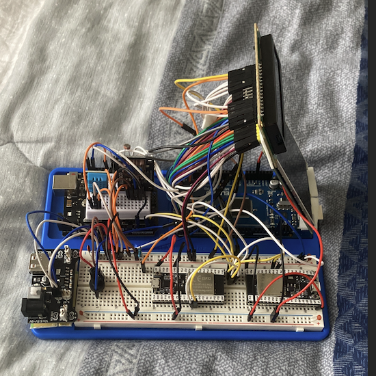
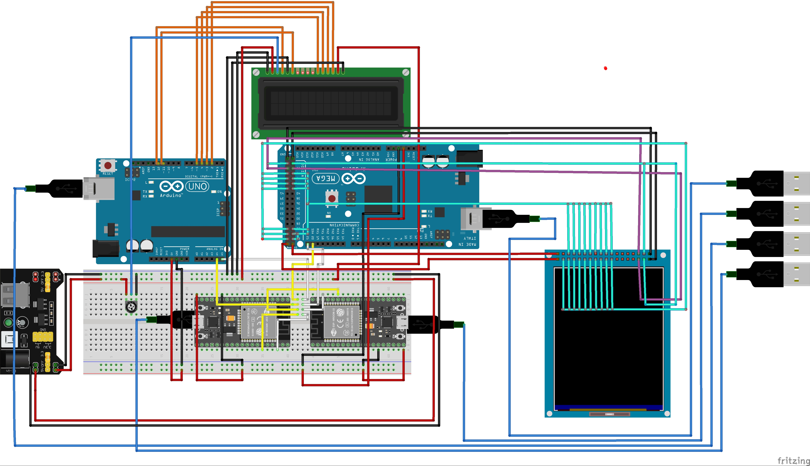
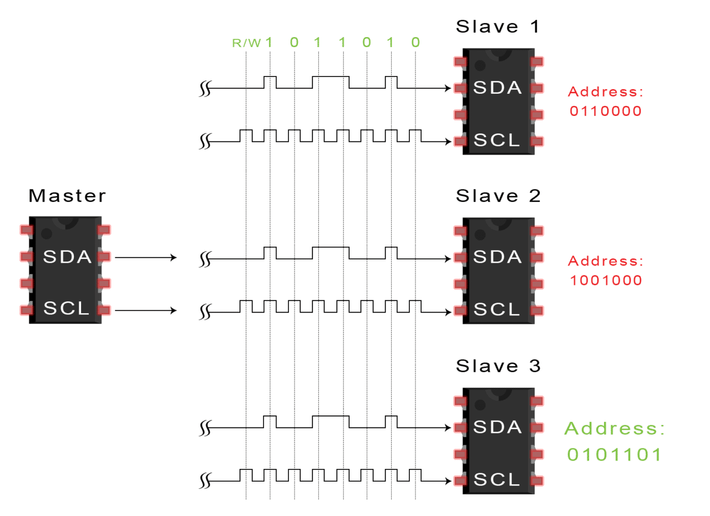

### **General Objective**

The primary goal of Synth Net is to develop an integrated system that enables efficient bidirectional communication between four microcontrollers—two ESP32 units, an Arduino Uno, and an Arduino Mega—using the I2C protocol. This system overcomes the inherent limitations of standard libraries by implementing custom functions tailored to support complex communication scenarios across multiple devices. The project seeks to optimize data exchange, processing, and display, creating a cohesive network where each microcontroller performs distinct, yet interdependent, roles.




------

### **Specific Objectives**

1. Configure two ESP32 microcontrollers, an Arduino Uno, and an Arduino Mega on a shared breadboard, establishing a robust I2C communication architecture.
2. Assign distinct roles to each microcontroller: one ESP32 will act as the master controlling the communication flow, the Arduino Mega will handle data visualization, the second ESP32 will retrieve real-time weather data via an API, and the Arduino Uno will gather environmental data through attached sensors.
3. Develop custom I2C communication functions that facilitate seamless bidirectional data transmission between the devices, effectively bypassing the limitations imposed by standard libraries.
4. Design and implement a custom graphical interface on the Arduino Mega that organizes and displays the collected data in a clear and user-friendly manner.
5. Conduct comprehensive testing to ensure the system’s stability, reliability, and seamless integration of all components, addressing potential hardware and software challenges.

------

### **Theoretical Framework**

**Microcontrollers:**

- **ESP32:** A high-performance microcontroller with built-in Wi-Fi and Bluetooth capabilities, the ESP32 is well-suited for applications that require wireless connectivity. Its powerful dual-core processor and abundant I/O options make it an ideal choice for managing complex tasks like coordinating a network of multiple devices.
- **Arduino Uno and Mega:** These popular microcontrollers, based on the ATmega328P (Uno) and ATmega2560 (Mega), are widely used due to their simplicity, large community support, and compatibility with a variety of sensors and modules. The Mega, with its increased memory and input/output pins, is ideal for handling more intensive tasks such as graphical data display.

**I2C Communication:**

The I2C (Inter-Integrated Circuit) protocol is a synchronous serial communication standard that allows multiple devices to communicate with one another using just two lines: SDA (data) and SCL (clock). Designed for efficient and reliable data transfer between microcontrollers and peripherals, I2C operates in a master-slave configuration. In Synth Net, the ESP32 serves as the master, directing communication between the microcontrollers and ensuring that data is transmitted and received without conflict, even in a highly concurrent system.

**API Integration for Real-Time Weather Data:**

The integration of external APIs, such as OpenWeather, enables the system to access real-time weather information. Using HTTP requests, the ESP32 retrieves JSON-formatted data, which is then parsed and optimized for minimal memory usage. Efficient serialization and deserialization are critical to ensure that only essential data is transmitted over the I2C bus, maintaining optimal system performance while minimizing overhead.


### **Synth Net System Description**

#### **General Architecture**

Synth Net consists of four microcontrollers interconnected on a single breadboard, utilizing the I2C protocol for communication. The architecture is designed in a master-slave configuration, where one ESP32 functions as the master and coordinates communication between the other devices. This architecture enables seamless data exchange and integration between the microcontrollers, each performing distinct tasks critical to the overall system functionality.

*(A block diagram illustrating the interconnection between the microcontrollers and their specific roles will be inserted here.)*

#### **Roles of Each Component**

- **ESP32 Master**
  - Functions and Responsibilities:
    - Manages I2C communication between all devices, acting as the central coordinator.
    - Hosts a local web server that provides an alternative method for data input, allowing users to interact with the system remotely.
    - Handles requests and responses from the slave devices, ensuring smooth data flow and execution of tasks.
- **Arduino Mega**
  - Functions and Responsibilities:
    - Responsible for rendering graphical elements such as logos and managing variables for display.
    - Displays a custom interface built in C, which presents the collected data in a clear, organized format. The interface facilitates real-time monitoring of system performance and environmental conditions.
- **ESP32 with Weather API Integration**
  - Data Integration and Retrieval:
    - Connects to the internet via Wi-Fi to retrieve real-time weather data through the OpenWeather API.
    - Parses the received JSON data and optimizes it by reducing the number of bytes, minimizing memory and storage usage, and ensuring efficient data transfer over the I2C bus.
- **Arduino Uno**
  - Environmental Data Collection:
    - Gathers environmental data using connected sensor modules, such as temperature and humidity sensors.
    - Sends the collected data to the ESP32 master for further processing and visualization on the Arduino Mega.

#### **Connections and Communication**

The communication between microcontrollers is established using the I2C protocol, with each device connected to the SDA (data) and SCL (clock) lines. These two lines facilitate bidirectional data transfer, allowing the ESP32 master to coordinate the flow of information between the microcontrollers. Custom functions were developed to optimize communication efficiency and resolve potential conflicts between libraries, ensuring stable operation under varying workloads.

#### **Materials and Components Used**

**Hardware:**

- **Microcontrollers:**
  - 2 x ESP32
  - 1 x Arduino Uno
  - 1 x Arduino Mega
- **Breadboard:**
  - Adequately sized breadboard to house and interconnect all components.
- **Modules and Sensors:**
  - Wi-Fi module integrated into the ESP32 for API communication.
  - Temperature and humidity sensors connected to the Arduino Uno for environmental data collection.
  - LCD display module connected to the Arduino Mega for graphical output.
- **Additional Components:**
  - Resistors and jumper wires for secure connections.
  - Voltage regulators (if necessary) to ensure proper power distribution across components.
  - LEDs for status indication and debugging purposes.

**Software and Programming Tools:**

- **Development Environment:**
  - Arduino IDE for programming both the ESP32 and Arduino microcontrollers.
- **Libraries Used:**
  - **Wire.h** for I2C communication.
  - **SPI.h** for SPI-based communication, complementing I2C in some scenarios.
  - Specific libraries for handling API requests and parsing JSON data from OpenWeather.
- **Design Tools:**
  - Circuit design software such as Fritzing to visualize and plan the system's physical layout.
  - C-based tools for creating custom graphical interfaces on the Arduino Mega.

## Software and Programming Tools

- **Arduino IDE**: Primary development environment used for programming both the ESP32 and Arduino microcontrollers.
- **PlatformIO**: An advanced development environment integrated into Visual Studio Code, providing enhanced debugging and project management features.
- **Doxygen**: A documentation generation tool used to automatically generate comprehensive technical documentation from inline comments in the code.
- **Fritzing**: A circuit design tool used for visualizing and planning the physical layout of components on the breadboard.
- **Git and GitHub**: Version control tools used to track changes in the project code and collaborate with others.

---

## Methodology

This chapter explains the process followed for designing, implementing, and testing the Synth Net system.

### Development Process

The development of Synth Net was divided into several stages:

1. **Circuit Design**: The physical layout of the ESP32, Arduino Uno, and Arduino Mega on a breadboard was visualized using Fritzing and optimized for efficient space usage.

2. **Programming**: Code for each microcontroller was written and compiled using the Arduino IDE and PlatformIO. Custom I2C communication functions were created to manage bidirectional data flow, and Doxygen was used to generate inline documentation for the code.

3. **Testing**: Functional testing was performed to ensure correct communication between devices over I2C, while performance testing focused on data accuracy and transmission speed.

   

---

## Challenges and Solutions

The development of Synth Net presented several challenges, which required creative solutions:

- **I2C Bus Limitations**: The maximum data payload size was constrained to 38 bytes per transmission. To address this, a data partitioning strategy was implemented, where larger data sets were split into smaller packets.
- **Library Conflicts**: Conflicts between standard libraries were resolved by writing custom functions to manage data transmission and reception.
- **Memory Management on ESP32**: To handle large JSON data from the weather API, the data was optimized by serializing only the required fields and reducing memory overhead.

---

## Results

### System Performance

The system successfully achieved the primary goal of establishing efficient bidirectional communication between four microcontrollers. All devices communicated effectively using the I2C protocol, and real-time data from sensors and the OpenWeather API was displayed on the Arduino Mega.

### Screenshots and Diagrams

Below are screenshots and images showing the system in operation:

![8C8F5728-E3CA-4460-B3B8-6DFF6634D2E8](/Users/renatorr/Downloads/coding/Github/SynthN




---

## Conclusions

The Synth Net project successfully demonstrated how multiple microcontrollers could be integrated into a single system using the I2C protocol. This project deepened my understanding of microcontroller communication and API integration. It also served as a rewarding personal and academic challenge that helped me improve my problem-solving skills.

---

## Future Work

There are several opportunities to expand and improve the Synth Net system in the future:

- **Additional Sensors**: Integrating more sensors, such as light or motion detectors, to broaden the system's functionality.
- **Enhanced User Interface**: Developing a more advanced graphical interface on the Arduino Mega or external devices like smartphones for an improved user experience.
- **Different Microcontrollers**: Experimenting with newer or more advanced microcontrollers like the Raspberry Pi Pico for enhanced processing power and capabilities.
- **AI Integration**: Utilizing AI algorithms to analyze the data collected and provide intelligent predictions or insights.

---

## References

1. [Wire.h - Arduino I2C Library](https://www.arduino.cc/en/reference/wire)
2. [OpenWeather API Documentation](https://openweathermap.org/api)
3. [ESP32 Documentation](https://docs.espressif.com/projects/esp-idf/en/latest/esp32/)

---

## Appendices


### `receive_citydataSize`

This function initiates a request to the I2C slave to receive the size of the city data structure. It is responsible for sending a custom request to the slave and then reading the size of the data to be transmitted. This size is then used in subsequent functions to retrieve and handle the data correctly.

#### Function Breakdown:
```cpp
void receive_citydataSize() {
    Wire.write(10); // Custom request to the slave
    Serial.println("Request sent to slave to receive 1 byte.");
    
    if (Wire.available()) {
        int sizeCityData = Wire.read(); // Reads the received byte, which represents the data size
        Serial.print("Number of bytes received from the slave: ");
        Serial.println(sizeCityData);
        
        Serial.println("Restarting I2C interface...");
        Serial.print("End of receiving structure size from slave.");
        
        // Calls the function to receive the actual city data using the size received
        recieve_cityData();
    } else {
        Serial.println("No data received from the slave.");
    }
}
```

#### Purpose:

The primary goal of `receive_citydataSize` is to:

1. Send a request to an I2C slave to retrieve the size of a data structure (in this case, city data).
2. Ensure that the size is read correctly and stored for later use in requesting the full data from the slave.
3. Pass the size information to `recieve_cityData`, which handles the actual data retrieval.

#### Key Steps:

1. **Sending the Request**: The function begins by sending a custom request (`Wire.write(10)`) to notify the slave to provide the size of the data it needs to send.
2. **Receiving Data**: It checks if data is available on the I2C bus (`Wire.available()`). If data is available, it reads the size of the city data and prints it to the Serial Monitor.
3. **Handling the Data**: If the size is successfully received, the function `recieve_cityData()` is called to retrieve the full data set from the slave.

#### Potential Errors:

- If no data is received, the function prints a message indicating that no data was available, and the process terminates without calling the next function.

### Related Functions:

- `recieve_cityData()`: Retrieves the city data from the slave based on the size provided by `receive_citydataSize`.
- `printCityData()`: Outputs the received city data to the Serial Monitor for verification and debugging purposes.

This function is a crucial step in ensuring that the correct amount of data is requested from the I2C slave, allowing for efficient communication between the ESP32 and the other microcontrollers or peripherals in the system.